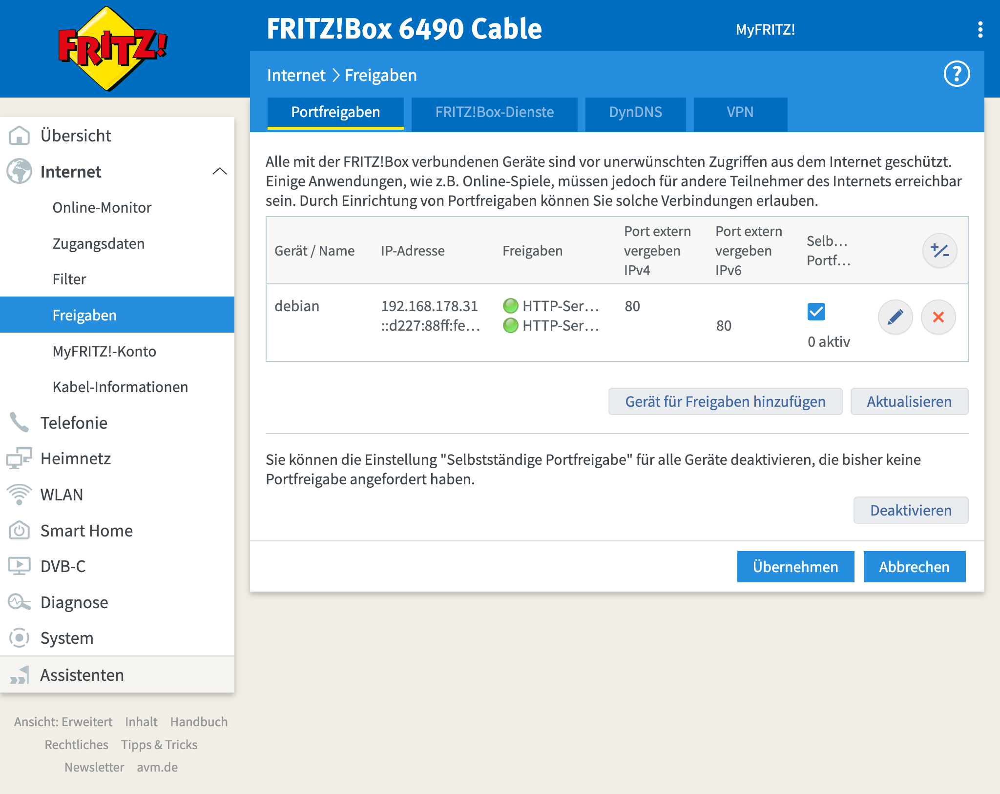
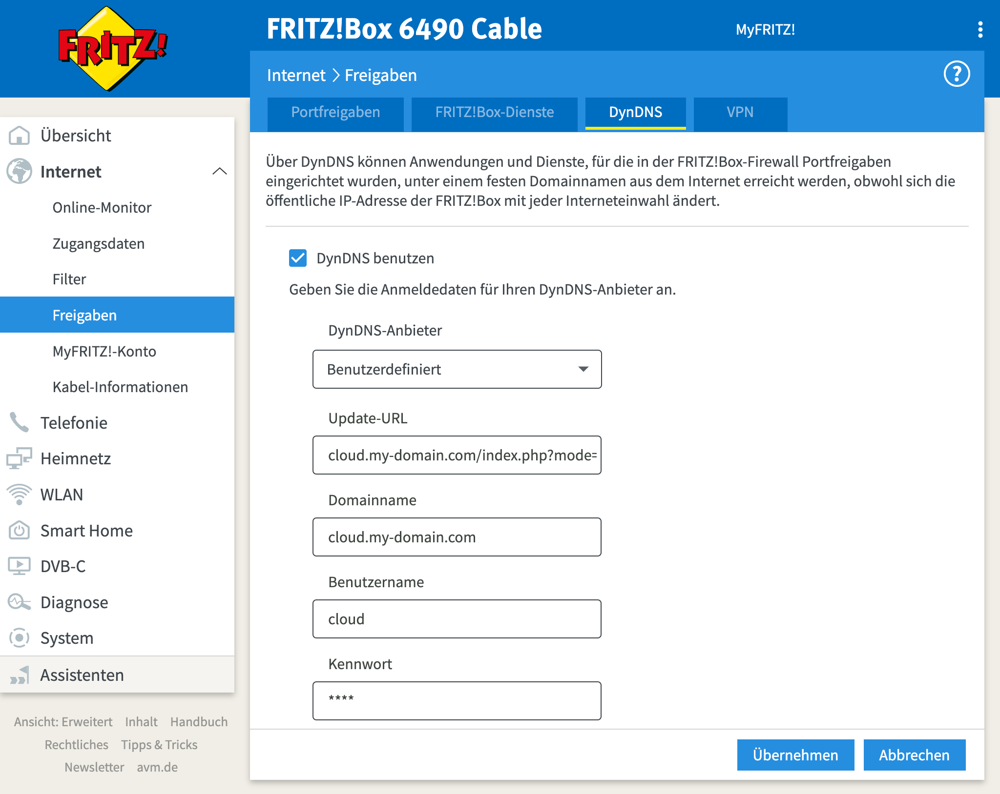

# DynDNS for Fritz.Box

Use your public domain/hosting as dyn dns.

Author: Carsten Walther

Date: March, 27th 2022

---

## Requirements

- PHP min. 7.4
- Composer

## Installation

Download this repository. Make shure you have installed composer. Unzip the package e.g. to `/var/www/dyndns/` an run

```bash
composer install
```

Done.

## Configuration

Add a file ```config.php``` into your root folder with the following content:

```php
<?php

const USERNAME = 'username'; // have to be the same in your fritzbox dyndns settings
const PASSWORD = 'password'; // have to be the same in your fritzbox dyndns settings

const PROTOCOL = 'http';
const PORT = '80'; // the port you have opened
const PATH = '/'; // path to your service
```

## Configure your FritzBox

At first you have to set port forwarding to make your local server reachable from outsite.



After that you have to add a user defined dyndns.



Add the following data:

**Update-URL:**
```
subdomain.yourdomain.com/index.php?mode=update&ipaddr=<ipaddr>&ip6addr=<ip6addr>&username=<username>&pass=<pass>&domain=<domain>
```
_Keep the placeholder in the brackets!_

**Domainname:**
```
subdomain.yourdomain.com
```
_Domainname is not used at the moment!_

**Username:**
```
username
```
_Have to be the same like set in your config.php file!_

**Password:**
```
password
```
_Have to be the same like set in your config.php file!_

## Running local

If everything is done you can run this locally via the build in php webserver for testing purposes. You have to call

```bash
php -S localhost:8000
```

## How to use

Open your browser and put the assress into the address bar and hit enter.

Then you will be redirected to the correct IP address of your local server.
